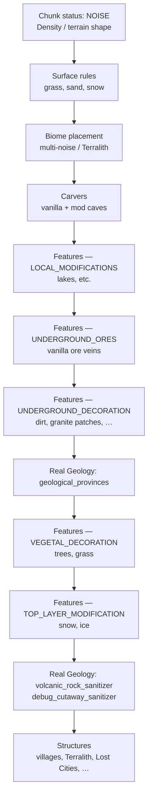
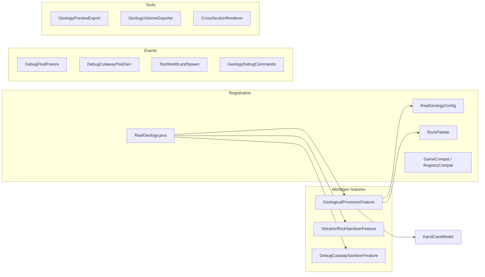
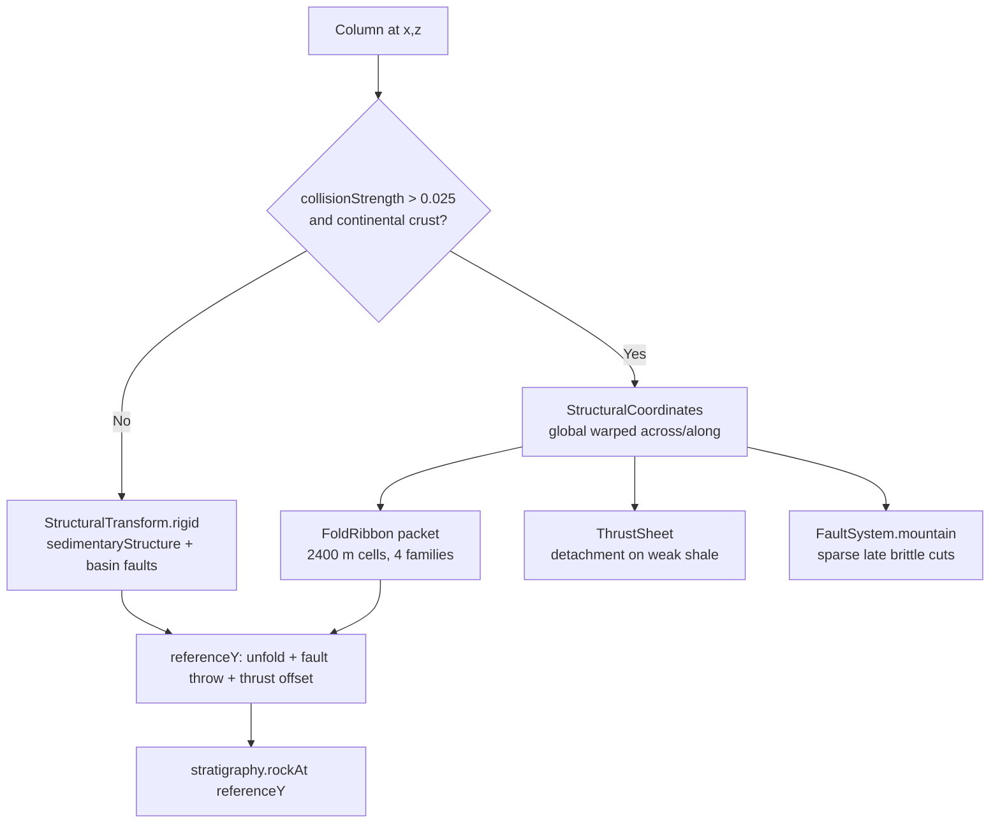
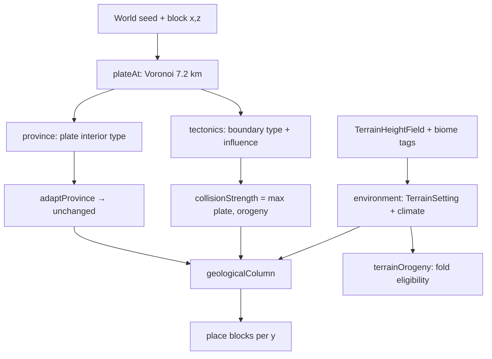
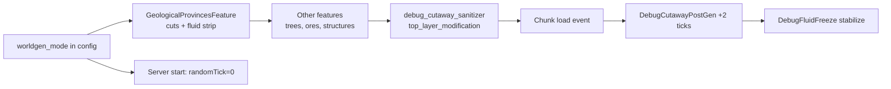
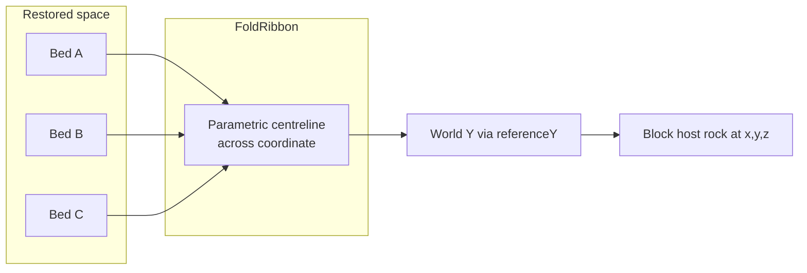

# Real Geology — World Generation System Paper

**Version context:** `0.21.0-beta.2+` (NeoForge 1.21.1 primary target)  
**Audience:** The mod author and future contributors — not players.  
**Goal:** Document *design intent* and *implementation approach* so you can see how AI-assisted iteration solved geological worldgen problems, what tradeoffs were accepted, and what remains planned.

This is **not** a user manual. For install and debug commands see [README.md](../README.md). For backlog see [ROADMAP.md](../ROADMAP.md). For playtest regressions see [KNOWN-ISSUES-PLATE-GEN.md](KNOWN-ISSUES-PLATE-GEN.md).

---

## 1. Purpose (for the human reader)

Real Geology replaces Minecraft’s generic underground stone palette with **seed-stable, coordinate-deterministic geology**: stratigraphic columns, structural deformation (folds, faults, thrusts), intrusions, and (when re-enabled) deposit-specific ore shapes.

The generator is implemented almost entirely in one placed feature — `GeologicalProvincesFeature` — plus a small set of companion features and event handlers. That concentration is deliberate: every block in a column must agree across chunk borders, which is far easier when one function owns the vertical solve.

**Why this document exists:**

- Map **problem → approach → tradeoff → known limitation** across months of AI-assisted design (Section 7).
- Explain what Real Geology **hooks into** vs **leaves alone** in vanilla/Terralith worldgen (Section 2).
- Give an honest **implemented vs planned** inventory so you can prioritize without re-reading ~3,000 lines of Java (Section 9).

**Critical constraint:** Generation runs only in **newly generated Overworld chunks**. Existing terrain is never rewritten.

---

## 2. How Minecraft worldgen works (relevant subset)

### 2.1 Chunk pipeline (simplified)

Minecraft 1.21+ Overworld generation is a multi-stage pipeline. Real Geology cares about the stages *after* noise terrain exists but *before* the player sees the world.

**What Real Geology does at each stage:**

| Stage | Real Geology involvement |
|-------|--------------------------|
| Noise / biomes / surface | **Reads only** — does not replace Terralith or vanilla terrain |
| Carvers | **Preserves** cave air/water by default; optional `karst_cave_mode` can add or replace (lab) |
| Underground ores | **Leaves vanilla** in beta.2; custom `deposit()` disabled |
| Underground decoration | **Primary hook** — `geological_provinces` placed feature |
| Top layer modification | **Post-pass** sanitizers for debug cutaways and blackstone cleanup |
| Structures | **Does not generate**; debug sanitizer may clear blocks inside cut volumes |

### 2.2 NeoForge integration

| Mechanism | Real Geology usage |
|-----------|-------------------|
| **Configured + placed features** | `realgeology:geological_provinces`, `volcanic_rock_sanitizer`, `debug_cutaway_sanitizer` |
| **Biome modifiers (`neoforge:add_features`)** | Inject features into `#minecraft:is_overworld` at specific `GenerationStep` values |
| **Biome modifiers (`neoforge:remove_features`)** | Strip GeoStrata duplicate ores (`remove_geostrata_ores.json`) |
| **Biome modifiers (code-only)** | `OptionalOreRemovalModifier` registered but **no datapack JSON** in beta.2 — vanilla ore stripping was reverted |
| **Event bus** | Debug commands, fluid freeze, spawn relocation, chunk-load sanitizer |

Registration entry point: `RealGeology.java`.

### 2.3 What Real Geology hooks into vs leaves alone

**Hooks into (replaces or post-processes):**

- Vanilla stone family blocks (`stone`, `deepslate`, `granite`, `diorite`, `andesite`, `tuff`, Terralith `blackstone` family) and **non-ore GeoStrata rocks** — see `replaceable()`.
- Loose marine veneer (`sand`, `gravel`, `clay`, `mud`) via `marineFloorSediment()`.
- Natural topsoil on steep/alpine slopes via `applySurfaceExposure()` — reveals bedrock without changing heightmap.
- Terralith thermal-cave blackstone → GeoStrata `basalt` / `diabase` (`volcanicReplacement`, `VolcanicRockSanitizerFeature`).

**Leaves alone:**

- Grass, dirt, sand beaches, terracotta, snow, ice, vegetation, structures.
- Heightmap / surface elevation (Terralith owns landforms).
- **Vanilla ore placed features** in beta.2 (coal, iron, copper, gold, diamond, etc.).
- Nether and End dimensions.

### 2.4 Fluids

- Normal worlds: lava pockets only in sealed thermal-base layer above bedrock; rare `MagmaticSystem` live cores in volcanic arcs.
- Debug modes (`section`, `ores`, `half_cut`): fluids stripped in cut columns; `DebugFluidFreeze` cancels spread and random tick; `DebugCutawayPostGen` re-strips on chunk load.

---

## 3. Real Geology architecture (~0.21.0-beta.2+)

### 3.1 Component map

### 3.2 `GeologicalProvincesFeature` — core algorithm

**File:** `src/main/java/com/azumoo/realgeology/worldgen/GeologicalProvincesFeature.java`

For each block column in a 16×16 chunk (from bedrock/min Y up to ocean-floor heightmap):

1. **Sample terrain context** — `TerrainHeightField` (128 m lattice, no neighbour chunk loads) + per-column heightmap for slope.
2. **Classify environment** — `environment()`: `TerrainSetting`, climate tags (`c:is_dry`, `is_wet`, …), Terralith tags (`terralith:highlands`, `terralith:cliffs`, `terralith:volcanic`), elevation, relief, water depth, plate tectonics.
3. **Select province** — `province()` from seeded Voronoi plates (~7.2 km); `adaptProvince()` currently **returns plate province unchanged** (biome hard-switch removed Aug 2026).
4. **Build geological column** — `geologicalColumn()`: stratigraphy, structural transform, unconformities, plate contact, magmatism, thrust splays.
5. **Place blocks** — marine sediment → thermal base → debug cutaway → volcanic replacement → intrusions → optional karst → disabled deposits → calcite accents → host rock via `RockPalette`.

Chunk-order independence is achieved by using **only** `(seed, x, y, z)` and pre-sampled column properties — no mutable chunk state.

### 3.3 Provinces and terrain settings

**Provinces** (`Province` enum): `SEDIMENTARY`, `PLUTONIC`, `VOLCANIC`, `MOUNTAIN` — inherited from plate interior type and boundary kinematics (`tectonics()`).

**Terrain settings** (`TerrainSetting` enum): derived from **visible** terrain, not plates alone:

| TerrainSetting | Typical trigger |
|----------------|-----------------|
| `OCEANIC_BASIN` | Deep ocean on oceanic plate |
| `CONTINENTAL_SLOPE` | Submerged continental crust, deep shelf |
| `PASSIVE_MARGIN` | Ocean/beach biomes on continental crust |
| `VOLCANIC_ARC` | Terralith volcanic tags or oceanic island |
| `COLLISION_BELT` | `OrogenicDomain.active()` from low-pass height field |
| `CONTINENTAL_BASIN` | Broad low-relief basin noise field |
| `STABLE_INTERIOR` | Default quiet land |

**Orogenic domain** (`terrainOrogeny()`): continuous fold eligibility from **broad elevation + crest relief**, explicitly **not** gated on mountain biome tags (fixes biome-edge fold jumps).

### 3.4 Plate framework

- **Scale:** `PLATE_SIZE = 7200` blocks (~7.2 km) — enlarged from 2.4 km to stop visible “geological room” repetition.
- **Motion:** Each plate cell gets a velocity vector; boundary classified as convergent / divergent / transform (`BoundaryType`).
- **Influence:** `boundaryDistance` drives continuous deformation strength (`collisionStrength()`), not binary province swaps.
- **Contacts:** `PlateContact` — inclined suture with dip, waviness, transform damage zone (sparse phyllite/amphibolite lenses). Only active within `boundaryDistance <= 0.065` to avoid Voronoi secondary-neighbour “cake cuts.”

### 3.5 Stratigraphic columns

Defined as `StratigraphicColumn` records with ordered `StratigraphicUnit(rock, minThickness, maxThickness)`.

| Column constant | Role in beta.2 |
|-----------------|----------------|
| `FOLDED_SEDIMENTARY_COLUMN` | **Primary continental inheritance** — many thin beds (4–17 block units) for readable folds |
| `OCEANIC_CRUST_COLUMN` | Gabbro → diabase → basalt stack |
| `SEDIMENTARY_COVER_COLUMN` | Young flat cover above unconformities |
| `SEDIMENTARY_COLUMN`, `PASSIVE_MARGIN_COLUMN`, `ALLUVIAL_COLUMN`, `ARID_BASIN_COLUMN`, `CONTINENTAL_SLOPE_COLUMN` | **Defined but not selected** as separate templates in `geologicalColumn()` — facies variation is applied via thickness scales, lenticular feathering, and environment switches instead |
| `MOUNTAIN_COLUMN` | Metamorphic core units — used when `foldedSedimentary` is false (rare in current terrain-guided model) |
| `PLUTONIC_COLUMN`, `VOLCANIC_COLUMN` | Used for plate-type secondary stratigraphy at contacts |

**Thickness variation:** Per-unit noise at ~1450 m, ~620 m, and ~260 m wavelengths (`StratigraphicUnit.thickness()`). Environment scales via `formationThicknessScale()` and `inheritedThicknessScale()`.

**Lenticular facies:** Limestone, dolomite, conglomerate, siltstone can feather 3→2→1→0 blocks through independent lobe fields (~820 m / ~340 m / ~170 m) in `sampleFromBase()`.

### 3.6 Structural transforms

**Fold families:** `OPEN`, `CHEVRON`, `ISOCLINAL`, `RECUMBENT` — parametric centreline (`FoldRibbon`) replaces old global sine height-field.

**Key design choices:**

- **Terrain-rooted deformation:** `mountainRootUplift()` translates the whole package; folding/thrusting provides shortening — avoids “inflated lower layer” artifact.
- **Weak detachment:** `preferredDetachmentHorizon()` picks shale/siltstone for thrust soles.
- **Transported thrust sheets:** Sample stratigraphy from `sourceX/sourceZ`, not duplicate local beds.

**Known structural issues:** Playtest reports fault offsets that look like layer doubling rather than true displacement — see [KNOWN-ISSUES-PLATE-GEN.md §7](KNOWN-ISSUES-PLATE-GEN.md).

### 3.7 `RockPalette` / GeoStrata dependency

**File:** `src/main/java/com/azumoo/realgeology/compat/RockPalette.java`

- Resolves `geostrata:<rock>` block states when mod is present.
- **26.2 experimental:** Maps rock names to vanilla substitutes (`shale`→`tuff`, `limestone`→`calcite`, `gneiss`→`deepslate`, etc.) — see [PORTING-26.md](../PORTING-26.md).
- Hosted ores try `geostrata:<host>_<ore>_ore` before fallback.

Real Geology **does not ship rock textures**; it arranges GeoStrata (or vanilla fallback) blocks into formations.

### 3.8 Deposit system — implemented but DISABLED in beta.2

**File:** `GeologicalProvincesFeature.deposit()` — **returns `null` immediately** with full implementation commented below.

Beta.2 changelog: vanilla `minecraft:ore_*` features restored; biome modifier that stripped them removed.

**Still present in codebase (not generating):**

- Porphyry stockworks, MVT districts, coal growth faults, kimberlite pipes, banded iron, pegmatite Li/Sn/U, etc. — see commented body in `deposit()` and [MATERIAL-CATALOG.md](../MATERIAL-CATALOG.md).
- `HostedOreBlock` + per-host JSON models under `assets/realgeology/models/block/*_ore/`.
- `OptionalOreRemovalModifier` for competing mod ores — registered in code, inactive without datapack + intentional enable.

### 3.9 Debug modes

Configured in `config/realgeology-common.toml` → `RealGeologyConfig`.

| Mode | Config value | Behavior |
|------|--------------|----------|
| Off | `off` | Normal generation |
| Section trenches | `section` | Air columns every 512 m (50 m wide); magma base preserved in trench |
| Ore-only | `ores` | Same grid but non-ore rock cleared to air |
| Half cut | `half_cut` | All blocks + fluids removed where **X < 0** |
| Force collision belt | `force_collision_belt` | Every column uses mountain fold solver (disposable test worlds) |
| Karst | `karst_cave_mode` | `off` / `overlay` / `lab` — see Section 5 |
| Variable tectonic base | `variable_tectonic_base` | Asthenosphere proxy thickness varies by setting |

**Supporting classes:**

| Class | Role |
|-------|------|
| `DebugCutawaySanitizer` / `DebugCutawaySanitizerFeature` | Late pass: clear vegetation, snow, structures in cut columns |
| `DebugCutawayPostGen` | Re-sanitize 2 ticks after chunk load |
| `DebugFluidFreeze` | Disable fluid spread + random tick in debug worlds |
| `TestWorldLandSpawn` | Relocate spawn to highland near cut plane; ocean→land for forced belt |
| `GeologyDebugCommands` | `/realgeology debug section|ores|clear` — temporary 384-block jobs in normal worlds |

**Inspection tools (non-worldgen):**

- `./gradlew runGeologyPreview` → SVG cross-sections
- `/realgeology debug volume [radius]` → RLE JSON + HTML viewer (`GeologyVolumeExporter`)

### 3.10 Companion features

| Feature | Step | Purpose |
|---------|------|---------|
| `geological_provinces` | `underground_decoration` | Main rock replacement |
| `volcanic_rock_sanitizer` | `top_layer_modification` | Catch late blackstone from Terralith thermal caves |
| `debug_cutaway_sanitizer` | `top_layer_modification` | Final air pass for debug cuts |

### 3.11 `GameCompat` dual-version shims

Shared sources compile against both NeoForge targets via version-specific shims:

| Subproject | Java | Loader API |
|------------|------|------------|
| `neoforge-1.21.1` | 21 | `ResourceLocation`, `getMinBuildHeight()`, ModDevGradle |
| `neoforge-26.2` | 25 | `Identifier`, `getMinY()`, NeoGradle userdev |

`RegistryCompat` holds block/item registration; `GameCompat` abstracts registries, permissions, spawn APIs, competing-feature ID checks.

---

## 4. Sediment rock layers (current implementation)

### 4.1 Rock names in active columns

Continental inheritance (`FOLDED_SEDIMENTARY_COLUMN`): conglomerate, shale, siltstone, limestone, dolomite (repeated in long succession).

Oceanic (`OCEANIC_CRUST_COLUMN`): gabbro, diabase, basalt.

Young cover (`SEDIMENTARY_COVER_COLUMN`): siltstone, limestone, shale over conglomerate basement.

Intrusive / contact rocks applied in `host()`: granite, diorite, pegmatite, diabase dikes, marble, hornfels, amphibolite, regional metamorphic grades.

### 4.2 Bed thickness variation

- Per-formation min/max ranges in column definitions (e.g. shale 5–14 in fold belt, 24–56 in passive margin template).
- Runtime scale: `inheritedThicknessScale()` — continuous 3.4 km + 1.25 km noise fields (not per-plate constant).
- Environment multiplier: e.g. `PASSIVE_MARGIN` 0.54–1.16 based on water depth; `COLLISION_BELT` 0.82 (thinner beds for fold readability).

### 4.3 Environments and facies

| Environment | Geological expression |
|-------------|----------------------|
| Marine / slope | `CONTINENTAL_SLOPE` / `OCEANIC_BASIN`: marine onlap base, pelagic shale/limestone veneer, thick loose seabed (`marineFloorSediment`) |
| Basin | `CONTINENTAL_BASIN`: sag structure, growth faults, coal seam logic (in disabled `deposit()`) |
| Mountain belt | `COLLISION_BELT`: `FoldRibbon` + thrusts; `foldedSedimentary = true`; eroded roof + optional valley cover unconformity |
| Arid / wet (climate tags) | Influence `thinInterbed()` pairing and (when deposits enabled) bauxite, saltpeter, coal — **not separate column templates today** |

### 4.4 Terralith / biome tag coupling

**Read at generation time** via `c:` tags (work without Terralith — tags simply false) and Terralith namespace tags:

- `is_mountain`, `is_hill`, `is_plateau`, `terralith:highlands`, `terralith:cliffs` → contribute to `mountain` flag (surface facies only; **not** fold gate since 0.21 architecture fix).
- `terralith:volcanic` → `VOLCANIC_ARC`.
- `is_dry`, `is_wet`, `is_hot`, `is_cold`, `is_beach`, `is_aquatic`, `is_river` → `Environment` climate fields.

**Vanilla fallback:** Without Terralith, `environment()` still runs from biome IDs, elevation, and `TerrainHeightField` — provinces are less varied but functional.

**Open issue:** Player mental model (“far inland high”) may not match `TerrainSetting` mapping — see [KNOWN-ISSUES-PLATE-GEN.md §6](KNOWN-ISSUES-PLATE-GEN.md). Instrumentation recommended before further tuning.

### 4.5 Known issues (from playtest doc)

| Issue | Status in code | Notes |
|-------|----------------|-------|
| Biome boundary cuts | **Partially addressed** — `adaptProvince()` no longer hard-switches; `terrainOrogeny()` decoupled from biome tags | `TerrainSetting` still discrete per column — blending not implemented |
| High coast lacks folds | **Open** — coast → `PASSIVE_MARGIN` → rigid structure unless `orogeny.active()` | |
| Weak fold amplitude | **Open** — amplitudes capped for playability | |
| Fault layer doubling | **Open** — suspected `referenceY` / fault sampling | |
| Terralith coupling verification | **Open** — no telemetry | |

---

## 5. Caves (honest status)

### 5.1 What Real Geology does NOT do yet (default config)

- **No lithology-guided vanilla carver replacement** — standard cheese/spaghetti/noodle caves still carve through all rock equally.
- **No dissolution following soft beds** between competent units (the main ROADMAP karst goal).
- **No coupling** of vanilla cave frequency to shale vs quartzite competence.

### 5.2 What exists today

| System | Status |
|--------|--------|
| Vanilla / Terralith carvers | **Active** — create `air` / `water` voids; geology respects them (`replaceable` skips air unless `karst_cave_mode = lab`) |
| `KarstCaveModel` | **Implemented, opt-in** — carbonate-only passages (`limestone`, `dolomite`, `marble`); elliptical conduits + rare chambers/shafts |
| `karst_cave_mode = overlay` | Adds karst voids alongside vanilla caves |
| `karst_cave_mode = lab` | Refills air/water in column before geology, then karst only — **destructive test mode** |
| GeoStrata caves | Not part of this mod — GeoStrata is a block library only here |

### 5.3 Roadmap (next cave phase)

From [ROADMAP.md](../ROADMAP.md):

1. Couple passage carving to hardness/solubility.
2. Prefer bedding-plane and unconformity surfaces.
3. Keep large vanilla/Terralith caves separate from dissolution network where possible.
4. Document interaction with future GeoTectonic if installed.

---

## 6. Other mod-owned parts

### 6.1 Hosted ore blocks

- **Registered** in `RegistryCompat` — one block ID per material with `HostedOreBlock.HOST` property.
- **128px overlay textures** per host rock under `assets/realgeology/textures/block/` (user-created art).
- **`c:ores/<material>`** tags for modpack recipe compatibility.
- **Not placed** in beta.2 worldgen (`deposit()` disabled).

### 6.2 Kimberlite block

- `realgeology:kimberlite` — standalone block (not a hosted-ore variant).
- Pipe placement logic exists in `diamondPipe()` / commented `deposit()` — **not generating** in beta.2.

### 6.3 Thermal base / asthenosphere proxy

- Default: 4 magma layers above bedrock (`thermal_base.magma_thickness`), rare sealed lava pockets.
- Optional `variable_tectonic_base`: thickness 4–50 blocks inversely tracks lithosphere “heat” from plate type, margin setting, long-wavelength noise.
- `thermalBaseTopY()` follows structural displacement slightly so roots move with faults/folds in section views.

### 6.4 Competing ore removal

- `remove_geostrata_ores.json` — active, removes GeoStrata ore features from Overworld.
- `OptionalOreRemovalModifier` — removes Create/Mekanism/etc. ores **if** datapack enables it; checks `GameCompat.isCompetingFeatureId()`.

### 6.5 Calcite accents

- Vanilla `calcite` block placed as cement, hydrothermal gangue, and cave-wall spar — not a stratigraphic formation name.

---

## 7. How AI applied solutions (meta section)

This table maps recurring problems to the approaches tried in this codebase. Use it to decide what to keep, revert, or redesign.

| Problem | Approach tried | Tradeoff | Known limitation |
|---------|----------------|----------|------------------|
| Underground is vanilla stone noise | Single placed feature replaces all `replaceable()` stone with `RockPalette` rocks | One 3k-line class; hard to test in isolation | Any mod adding non-replaceable stone bypasses geology |
| Need 30+ rock types without art budget | **GeoStrata dependency** for block IDs/textures | Fast, good visuals; license separate | 26.2 blocked until GeoStrata ports or owned blocks |
| 26.2 compile without GeoStrata | `RockPalette` vanilla fallback + dual `GameCompat` | Boots and generates | Wrong colors; hosted ore models still parent GeoStrata |
| Plates too small (2.4 km “rooms”) | Enlarge to **7.2 km** + terrain-driven orogeny | Less periodic repetition | Plate signal still visible on long trenches |
| Biome flips changed entire columns | Removed `adaptProvince()` hard switch; terrain orogeny from height field | Smoother folds across biome edges | `TerrainSetting` still discrete — coast vs interior jumps remain |
| Plate secondary neighbour caused vertical walls | `PlateContact` only within 0.065 boundary; canonical plate ordering | Fixed 40–95 block “cake cuts” | Rare transform walls still read too clean |
| Folds looked like sine stripes | **FoldRibbon** finite packets + 4 families | Readable anticlines/thrusts | Cannot represent true recumbent nappe overlap (single-valued Y) |
| Mountain = one rock type above stack | Extended `FOLDED_SEDIMENTARY_COLUMN` upward; eroded roof | Folds visible at surface | Very high peaks still stretch youngest unit |
| Ore shapes unrealistic | Full `deposit()` with seams, stockworks, districts | Geologically literate | Disabled for beta stability — vanilla blobs returned |
| Beta testers need ores now | Re-enable vanilla ore features; disable `deposit()` | Playable mining | Host rock / deposit story disconnected until re-enabled |
| Debug trenches fill with trees/water | `DebugCutawaySanitizer` + fluid freeze + post-load strip | Clean sections | Permanent in saved chunks — disposable worlds only |
| Screenshot half-world | `half_cut` mode + spawn relocation facing west | Fast visual QA | Not representative of normal generation |
| Chunk neighbour crash in `environment()` | `TerrainHeightField` 128 m lattice | Stable loading | Approximates broad relief, not exact per-column noise |
| Terralith blackstone in caves | `VolcanicRockSanitizerFeature` late pass | Consistent mafic naming | Extra feature step |
| Karst without breaking vanilla | `KarstCaveModel` opt-in + host-rock gate | Safe default | Default `off` — no player-visible karst yet |
| Province from terrain vs plate map | **Both:** plates for history/orientation; terrain for deformation | More realistic mountains on Terralith | Coupling not fully verified in playtest |
| AI over-generated vertical faults | Removed graben towers; sparse `FaultSystem.mountain` | Less artificial walls | Fault doubling artifact may remain |
| Facies diversity without new blocks | Lenticular feathering + interbeds in shared column | No new block IDs | `ALLUVIAL_COLUMN` etc. unused — dead constants |

---

## 8. Diagram suggestions

### 8.1 Province selection flow (current beta.2)

### 8.2 Debug mode pipeline

### 8.3 Fold transform concept (side view)

---

## 9. Implemented vs planned (summary)

### Implemented and active in beta.2

- [x] `GeologicalProvincesFeature` rock replacement (GeoStrata / vanilla fallback)
- [x] Seeded plates, boundary kinematics, inclined `PlateContact`
- [x] Terrain-guided `OrogenicDomain` and `FoldRibbon` deformation
- [x] Stratigraphic columns with thickness noise, lenticular facies, thin interbeds
- [x] Unconformities, younger cover, thrust transport, magmatic systems, dikes
- [x] Thermal asthenosphere proxy (fixed + optional variable)
- [x] Marine floor sediment veneer, alpine bedrock exposure
- [x] **Vanilla ore generation** (restored)
- [x] GeoStrata ore feature removal
- [x] Debug modes: section, ores, half_cut, fluid freeze, sanitizers, spawn tools
- [x] Cross-section / volume export tooling
- [x] Dual-version NeoForge build (1.21.1 + 26.2 experimental)
- [x] `KarstCaveModel` code path (default **off**)

### Implemented but disabled / dormant

- [ ] Custom `deposit()` ore placement (code present, returns null)
- [ ] `OptionalOreRemovalModifier` datapack (code registered, no JSON)
- [ ] Kimberlite pipes in world
- [ ] Separate facies column templates (`ALLUVIAL_COLUMN`, etc.) — superseded by lenticular logic
- [ ] `force_collision_belt` spawn mover (only when that flag set without cut spawn mode)

### Planned (ROADMAP)

- [ ] Re-enable deposit shapes + host-aware ores
- [ ] Karst / dissolution caves following soft beds
- [ ] Owned sedimentary blocks (sandstone, mudstone, gypsum, …) — reduce GeoStrata dependency
- [ ] `TerrainSetting` blending across boundaries
- [ ] Surface hydrology (salt lakes, glaciers, peat)
- [ ] Long-term: Dr Stone-style progression (separate effort)

---

## 10. Deployment profiles

This paper describes **0.21.0-beta.2** behavior in source. What you see in-game depends on which game directory and JAR you launch. As of 2026-08-29:

| Profile | Game directory | Real Geology version | GeoStrata | Terralith | Notes |
|---------|----------------|----------------------|-----------|-----------|-------|
| **run-publish-test** (Gradle dev) | `geology-overhaul/run-publish-test/` | **0.21.0-beta.2** — loaded from the `:neoforge-1.21.1` dev run classpath (`publishTestClient` / `runPublishTestClient`); optional `./scripts/launch-test-instance.sh --stage-jars` copies `realgeology-*.jar` into `run-publish-test/mods/` | Copied from `libs/` or `MODPACK_MODS` at launch | **Not** in the default minimal instance | Typical QA config: `worldgen_mode = "half_cut"`, `variable_tectonic_base = false`, `karst_cave_mode` default **off**. See [TEST-INSTANCE.md](../TEST-INSTANCE.md). |
| **realgeology-minimal-world-test** (TLauncher) | `~/.minecraft/versions/Modern_Industry_Colonies_1.21.1/realgeology-minimal-world-test/` | **0.21.0-beta.2** (`realgeology-0.21.0-beta.2.jar`) — same `mod_version` as [gradle.properties](../gradle.properties); byte hash may differ from a fresh `./gradlew :neoforge-1.21.1:jar` build | `geostrata-1.2.0-1.21.1-NEOFORGE.jar` | **Absent** — province logic uses vanilla elevation / biome heuristics (Section 4.4 fallback) | Stripped mod set (GeoStrata + Real Geology + Architectury + Sodium/Iris + Distant Horizons). Config: `worldgen_mode = "section"`, `karst_cave_mode = "lab"`, `variable_tectonic_base = true`, `spawn_highland_near_cut = true`. **Not** representative of a Terralith modpack playthrough. |
| **Modern Industry & Colonies** (full modpack) | `~/.minecraft/versions/Modern Industry & Colonies/` | **0.21.0-fault-wedges-curved-asthenosphere** (`realgeology-0.21.0-fault-wedges-curved-asthenosphere.jar`) — **older pre-beta.2 line**; do not assume parity with this paper without diffing JARs | `geostrata-1.2.0-1.21.1-NEOFORGE.jar` | `Terralith_1.21.1_v2.6.2_Neoforge.jar` | Normal play: `worldgen_mode = "off"` ([docs/publish/realgeology-common-beta.toml](publish/realgeology-common-beta.toml)); pack config may set `karst_cave_mode = "lab"` for karst QA. Lost Cities, Create, etc. add structure and surface competition not covered here. |

**Related instance:** `Modern_Industry_Colonies_1.21.1/` (underscore pack folder) ships **beta.2** in its shared `mods/` folder (~46 mods, no Terralith in that tree). Sub-instances include `realgeology-minimal-world-test` (above) and `realgeology-terrain-test` (beta.2 + a broader MIC slice, still without Terralith).

**When this paper applies:** Treat **beta.2** source and the **run-publish-test** / **minimal-world-test** configs as the reference for current architecture. Treat the **full modpack fault-wedges JAR** as a separate deployment until the pack is updated to beta.2.

---

## 11. Key source files (quick index)

| File | Responsibility |
|------|----------------|
| `worldgen/GeologicalProvincesFeature.java` | Entire geological solver |
| `worldgen/KarstCaveModel.java` | Optional carbonate cave geometry |
| `worldgen/VolcanicRockSanitizerFeature.java` | Blackstone cleanup |
| `worldgen/DebugCutawaySanitizer*.java` | Debug volume cleaning |
| `worldgen/DebugFluidFreeze.java` | Static fluids in debug worlds |
| `worldgen/TestWorldLandSpawn.java` | Debug spawn relocation |
| `worldgen/OptionalOreRemovalModifier.java` | Competing ore strip (dormant) |
| `compat/RockPalette.java` | GeoStrata → block state |
| `compat/GameCompat.java` / `RegistryCompat.java` | Version shims + registration |
| `RealGeologyConfig.java` | Debug + thermal + karst toggles |
| `RealGeology.java` | Mod entry, feature registration |
| `block/HostedOreBlock.java` | Host-state ore blocks |
| `data/realgeology/neoforge/biome_modifier/*.json` | Feature injection / GeoStrata ore removal |

---

*Document generated from source and design notes as of 2026-08-29. When behavior diverges from this paper, trust the Java source and CHANGELOG.*
